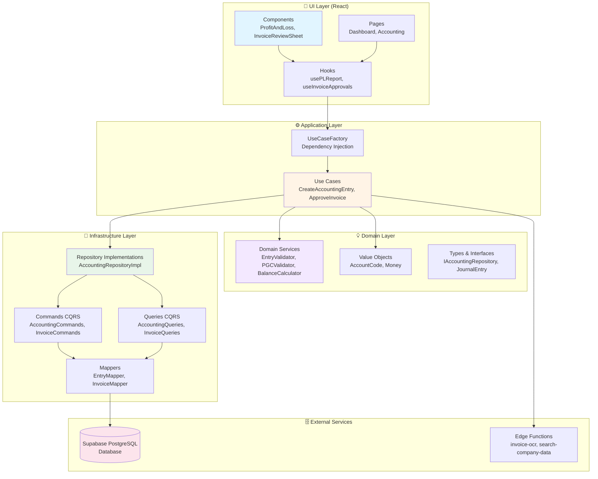
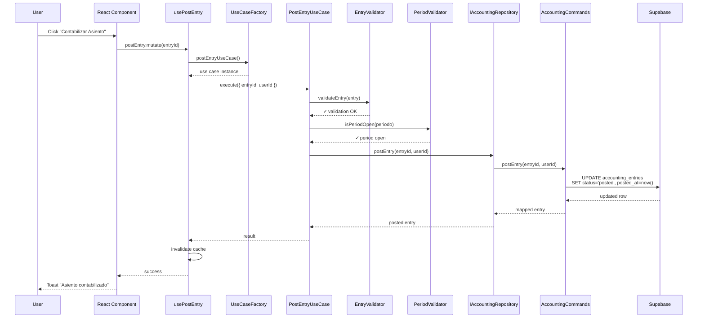

# 🏗️ Arquitectura del Sistema - FranquiConta

## Visión General

FranquiConta sigue una arquitectura **Clean Architecture** (hexagonal) con separación clara de capas y responsabilidades, implementando principios de Domain-Driven Design (DDD) y Command Query Responsibility Segregation (CQRS).

---

## Diagrama de Capas



---

## Principios de Diseño

### 1. **Separación de Capas (Separation of Concerns)**

Cada capa tiene responsabilidades claramente definidas:

| Capa | Responsabilidad | Dependencias |
|------|-----------------|--------------|
| **UI Layer** | Presentación, gestión de estado local, interacción con usuario | Application Layer |
| **Application Layer** | Orquestación de casos de uso, coordinación de flujos | Domain Layer |
| **Domain Layer** | Lógica de negocio pura, reglas del Plan General Contable | Ninguna (independiente) |
| **Infrastructure Layer** | Implementaciones técnicas (BD, APIs, parsers) | Domain Layer (interfaces) |

### 2. **Dependency Inversion Principle**

Las capas superiores dependen de abstracciones, no de implementaciones concretas.

```typescript
// ✅ CORRECTO: Use Case depende de abstracción
export class CreateAccountingEntryUseCase {
  constructor(private repository: IAccountingRepository) {}
  
  async execute(input: CreateEntryInput): Promise<JournalEntry> {
    // Use case no sabe si usa Supabase, MongoDB, etc.
    return this.repository.createEntry(input);
  }
}

// ❌ INCORRECTO: Use Case depende de implementación concreta
export class CreateAccountingEntryUseCase {
  constructor(private supabase: SupabaseClient) {}
  
  async execute(input: CreateEntryInput) {
    // Acoplamiento directo a Supabase
    return supabase.from('accounting_entries').insert(input);
  }
}
```

### 3. **CQRS (Command Query Responsibility Segregation)**

Separación clara entre operaciones de **lectura** (Queries) y **escritura** (Commands):

```typescript
// ✅ Queries: Solo lectura (SELECT)
export class AccountingQueries {
  static async findEntryById(id: string): Promise<JournalEntry | null> {
    const { data } = await supabase
      .from('accounting_entries')
      .select('*')
      .eq('id', id)
      .single();
    return data ? EntryMapper.toDomain(data) : null;
  }
}

// ✅ Commands: Solo escritura (INSERT/UPDATE/DELETE)
export class AccountingCommands {
  static async createEntry(command: CreateEntryCommand): Promise<JournalEntry> {
    const { data } = await supabase
      .from('accounting_entries')
      .insert(EntryMapper.toDatabase(command))
      .select()
      .single();
    return EntryMapper.toDomain(data);
  }
}
```

**Ventajas de CQRS:**
- ✅ Optimización independiente de lectura vs escritura
- ✅ Queries especializados (joins complejos, agregaciones)
- ✅ Escalabilidad horizontal (replicas para lectura)
- ✅ Caché granular solo en Queries

### 4. **Domain-Driven Design (DDD)**

El dominio contable está modelado según conceptos del **Plan General Contable Español**:

```typescript
// Value Objects: Inmutables, auto-validados
export class AccountCode {
  private constructor(private readonly value: string) {}
  
  static create(code: string): AccountCode {
    if (!/^\d{7}$/.test(code)) {
      throw new Error('Código de cuenta inválido (debe tener 7 dígitos)');
    }
    return new AccountCode(code);
  }
  
  getGroup(): string {
    return this.value.charAt(0); // Grupo PGC (1-9)
  }
}

// Domain Services: Lógica de negocio compleja
export class BalanceCalculator {
  static calculateTrialBalance(entries: JournalEntry[]): TrialBalance {
    // Cálculo de sumas y saldos según PGC
  }
}
```

---

## Flujo de Datos Típico

### Ejemplo: Crear y Contabilizar un Asiento



---

## Estructura de Directorios

```
src/
├── components/                # UI Layer
│   ├── accounting/           # Componentes específicos de contabilidad
│   ├── invoices/             # Componentes de facturas
│   ├── pl/                   # Componentes de P&L
│   └── ui/                   # Componentes reutilizables (shadcn)
│
├── pages/                    # Páginas principales
│   ├── accounting/           # Páginas de contabilidad
│   ├── admin/                # Administración
│   └── invoices/             # Facturas
│
├── hooks/                    # Custom React Hooks
│   ├── useAccountingEntries.ts
│   ├── useInvoiceApprovals.ts
│   └── usePLReport.ts
│
├── domain/                   # Domain Layer (lógica pura)
│   ├── accounting/
│   │   ├── repositories/     # Interfaces (contratos)
│   │   ├── services/         # Domain Services (validadores, calculadores)
│   │   ├── use-cases/        # Application Use Cases
│   │   ├── types.ts          # Domain Types
│   │   └── value-objects/    # Value Objects (AccountCode, Money)
│   │
│   ├── invoicing/
│   │   ├── repositories/
│   │   ├── services/
│   │   └── use-cases/
│   │
│   └── banking/
│       ├── repositories/
│       ├── services/
│       └── use-cases/
│
└── infrastructure/           # Infrastructure Layer (implementaciones)
    └── persistence/
        └── supabase/
            ├── repositories/ # Implementaciones concretas
            ├── commands/     # CQRS Commands
            ├── queries/      # CQRS Queries
            └── mappers/      # DTO ↔ Domain mappers
```

---

## Ventajas de esta Arquitectura

| Beneficio | Descripción |
|-----------|-------------|
| **✅ Testabilidad** | Cada capa se testea aisladamente con mocks de interfaces |
| **✅ Mantenibilidad** | Cambios en UI no afectan Domain, cambios en BD no afectan Use Cases |
| **✅ Escalabilidad** | Fácil añadir nuevos use cases, dominios o canales (web, móvil, API) |
| **✅ Flexibilidad** | Cambiar Supabase por otra BD sin tocar Domain o Application |
| **✅ Claridad** | Flujos de datos predecibles, responsabilidades claras |
| **✅ Evolución** | Refactorizar sin romper contratos (interfaces estables) |

---

## Patrones Implementados

| Patrón | Uso en FranquiConta |
|--------|---------------------|
| **Repository Pattern** | Abstracción de persistencia (`IAccountingRepository`) |
| **CQRS** | Separación Commands/Queries para optimización |
| **Factory Pattern** | `UseCaseFactory` para inyección de dependencias |
| **Mapper Pattern** | Conversión DTO ↔ Domain (`EntryMapper`, `InvoiceMapper`) |
| **Value Objects** | `AccountCode`, `Money` (inmutables, auto-validados) |
| **Domain Services** | `BalanceCalculator`, `PGCValidator` (lógica compleja) |

---

## Ejemplo Completo: Flujo de Aprobación de Factura

```typescript
// 1. UI LAYER: Componente React
function InvoiceReviewSheet({ invoice }: Props) {
  const { approveInvoice } = useInvoiceApprovals();
  
  const handleApprove = () => {
    approveInvoice.mutate({ 
      invoiceId: invoice.id, 
      level: 'manager' 
    });
  };
  
  return <Button onClick={handleApprove}>Aprobar</Button>;
}

// 2. APPLICATION LAYER: Hook
export function useInvoiceApprovals() {
  const queryClient = useQueryClient();
  
  return useMutation({
    mutationFn: async ({ invoiceId, level }) => {
      const useCase = UseCaseFactory.approveInvoiceUseCase();
      return useCase.execute({ invoiceId, level, userId });
    },
    onSuccess: () => {
      queryClient.invalidateQueries(['invoices']);
    },
  });
}

// 3. DOMAIN LAYER: Use Case
export class ApproveInvoiceUseCase {
  constructor(private repository: IInvoiceRepository) {}
  
  async execute(input: ApproveInvoiceInput) {
    // Validar
    const validation = InvoiceValidator.validateInvoice(input.invoice);
    if (!validation.valid) throw new Error('Invalid invoice');
    
    // Determinar siguiente estado
    const nextStatus = ApprovalEngine.determineNextStatus(
      input.invoice.approvalStatus,
      input.level
    );
    
    // Persistir
    return this.repository.updateInvoiceReceived(input.invoiceId, {
      approvalStatus: nextStatus,
    });
  }
}

// 4. INFRASTRUCTURE LAYER: Repository Implementation
export class InvoiceRepositoryImpl implements IInvoiceRepository {
  async updateInvoiceReceived(id: string, updates: Partial<Invoice>) {
    return InvoiceCommands.updateInvoiceReceived(id, updates);
  }
}

// 5. INFRASTRUCTURE LAYER: Command
export class InvoiceCommands {
  static async updateInvoiceReceived(id: string, updates: any) {
    const { data } = await supabase
      .from('invoices_received')
      .update(InvoiceMapper.toDatabase(updates))
      .eq('id', id)
      .select()
      .single();
    
    return InvoiceMapper.toDomain(data);
  }
}
```

---

## Testing en cada Capa

```typescript
// ✅ Unit Test: Domain Service
describe('EntryValidator', () => {
  it('debe validar que debe = haber', () => {
    const result = EntryValidator.validateBalance([...]);
    expect(result.valid).toBe(true);
  });
});

// ✅ Unit Test: Use Case (con mock de repository)
describe('ApproveInvoiceUseCase', () => {
  it('debe aprobar factura correctamente', async () => {
    const mockRepo = { updateInvoiceReceived: vi.fn() };
    const useCase = new ApproveInvoiceUseCase(mockRepo);
    await useCase.execute({ invoiceId: '123', level: 'manager' });
    expect(mockRepo.updateInvoiceReceived).toHaveBeenCalled();
  });
});

// ✅ Integration Test: End-to-End
describe('Invoice Approval Flow E2E', () => {
  it('debe procesar factura desde creación hasta asiento', async () => {
    // Test real sin mocks, validando flujo completo
  });
});
```

---

## Referencias

- **Clean Architecture**: Robert C. Martin (Uncle Bob)
- **Domain-Driven Design**: Eric Evans
- **CQRS**: Martin Fowler, Greg Young
- **Plan General Contable**: ICAC España
- **Supabase**: [docs.supabase.com](https://docs.supabase.com)
