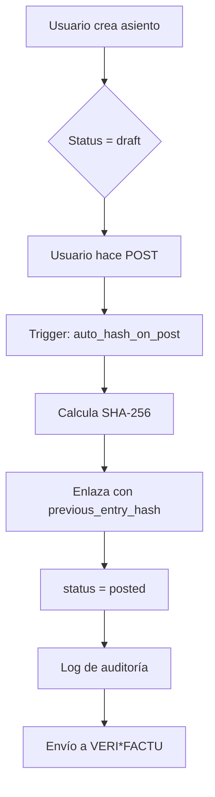
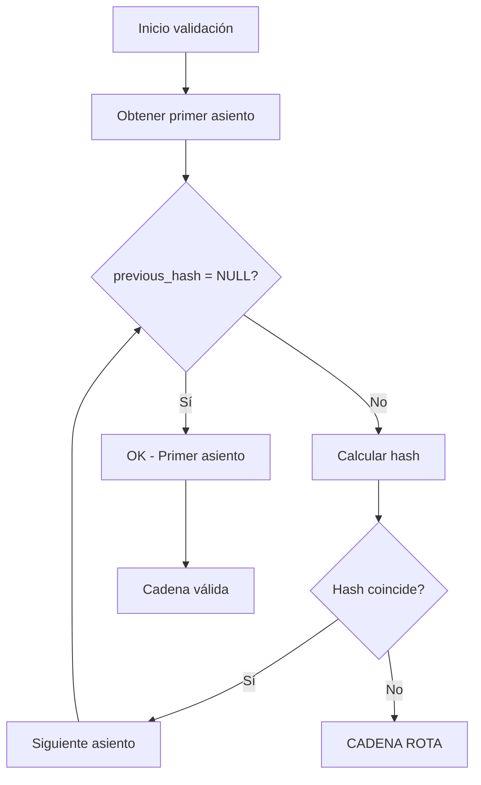

# 📋 Cumplimiento Normativo Fiscal Español

## 🎯 Marco Legal

### Legislación Aplicable
- **Ley 11/2021** - Art. 29.2.j: Obligaciones de integridad y conservación
- **Real Decreto 1007/2023** (modificado por RD 254/2025): Requisitos técnicos
- **VERI*FACTU / SIF**: Sistema de Integridad de Facturación

---

## ✅ Requisitos Implementados

### 1. 🔐 Inalterabilidad y Trazabilidad

#### ✓ Hash SHA-256 de Asientos
```sql
-- Función: calculate_entry_hash()
-- Genera hash SHA-256 de cada asiento contable
-- Campos incluidos: entry_number, entry_date, description, total_debit, total_credit
```

**Implementación:**
- `supabase/migrations/XXXXXX_accounting_integrity.sql` (líneas 8-39)
- `src/lib/accounting/integrity/entryHashService.ts`
- Columna: `accounting_entries.entry_hash`

#### ✓ Cadena de Integridad (Blockchain-style)
```sql
-- Campo: previous_entry_hash
-- Cada asiento enlaza con el anterior mediante su hash
-- Función: validate_entry_chain() verifica toda la cadena
```

**Validación:**
- Detecta modificaciones no autorizadas
- Identifica punto exacto de ruptura
- Genera informe de validación

#### ✓ Bloqueo de Asientos (Lock)
```sql
-- Campo: locked_at
-- Constraint: check_locked_immutable
-- Función: lock_accounting_entry()
```

**Protección:**
- Asientos bloqueados son **inmutables**
- Intento de modificación genera **incidente**
- Solo usuarios autorizados pueden bloquear

---

### 2. 📝 Auditoría Completa

#### ✓ Log de Auditoría (`accounting_entry_audit_log`)
```sql
CREATE TABLE accounting_entry_audit_log (
  id uuid PRIMARY KEY,
  entry_id uuid NOT NULL,
  action text NOT NULL,         -- INSERT, UPDATE, DELETE
  old_values jsonb,              -- Valores anteriores
  new_values jsonb,              -- Valores nuevos
  changed_fields text[],         -- Campos modificados
  user_id uuid,
  timestamp timestamptz DEFAULT now(),
  ip_address inet,
  user_agent text
);
```

**Registro automático:**
- Trigger: `accounting_entries_audit_trigger`
- Captura TODOS los cambios
- Incluye usuario, IP, timestamp

#### ✓ Libro de Incidencias (`accounting_incident_log`)
```sql
CREATE TABLE accounting_incident_log (
  id uuid PRIMARY KEY,
  incident_type text NOT NULL,   -- modification_attempt, unauthorized_access, etc.
  severity text NOT NULL,        -- info, warning, error, critical
  description text NOT NULL,
  entry_id uuid,
  user_id uuid,
  incident_date timestamptz DEFAULT now(),
  resolved boolean DEFAULT false,
  resolution_notes text,
  technical_details jsonb
);
```

**Tipos de incidentes:**
- `modification_attempt`: Intento de modificar asiento bloqueado
- `unauthorized_access`: Acceso no autorizado
- `data_integrity_failure`: Fallo en cadena de hash
- `backup_failure`: Error en backup
- `system_error`: Error del sistema
- `manual_override`: Override manual
- `regulatory_report`: Reporte regulatorio

---

### 3. 🔢 Numeración Correlativa

#### ✓ Secuencia Única por Ejercicio
```sql
-- Campo: entry_number (integer NOT NULL)
-- Serie: accounting_entries.serie (DEFAULT 'GENERAL')
-- Ejercicio: fiscal_year_id
```

**Garantías:**
- Sin saltos ni duplicados
- Ordenación cronológica
- Verificación automática

---

### 4. 🕐 Conservación de Datos

#### ✓ Retención Mínima 6 Años
```sql
-- Constraint: prevent_deletion_within_6_years
-- No se permite DELETE de asientos < 6 años
```

**Política de conservación:**
- Datos contables: **6 años mínimo**
- Facturas y documentos: **6 años mínimo**
- Logs de auditoría: **permanente**

---

### 5. 📡 Preparación VERI*FACTU / LRE

#### ✓ Tabla de Registro (`verifactu_registry`)
```sql
CREATE TABLE verifactu_registry (
  id uuid PRIMARY KEY,
  entry_id uuid REFERENCES accounting_entries(id),
  verifactu_id text UNIQUE,              -- ID asignado por AEAT
  signature text NOT NULL,                -- Firma electrónica
  signature_algorithm text NOT NULL,      -- Algoritmo (RSA, ECDSA)
  qr_code text,                          -- Código QR para validación
  sent_at timestamptz,                   -- Fecha envío a AEAT
  status text DEFAULT 'pending',          -- pending, sent, accepted, rejected
  aeat_response jsonb,                   -- Respuesta AEAT
  created_at timestamptz DEFAULT now()
);
```

**Campos en `accounting_entries`:**
- `verifactu_id`: ID único VERI*FACTU
- `digital_signature`: Firma electrónica
- `signature_algorithm`: Algoritmo usado
- `lre_sent_at`: Fecha envío Libro de Registro Electrónico

#### ✓ Firma Electrónica
- Algoritmo: **SHA-256 + RSA/ECDSA**
- Certificado: Pendiente integración con proveedor
- Formato: Compatible con AEAT

---

## 🚀 Funcionalidades de Cumplimiento

### UI Components

#### `EntryIntegrityBadge`
```tsx
<EntryIntegrityBadge
  entryHash={entry.entry_hash}
  chainValidated={entry.chain_validated}
  lockedAt={entry.locked_at}
  status={entry.status}
/>
```

**Estados visuales:**
- 🟢 **Integridad OK**: Hash válido, cadena verificada
- 🔒 **Bloqueado**: Asiento inmutable
- ⚠️ **Sin hash**: Requiere recálculo
- 🔴 **Cadena rota**: Integridad comprometida
- ⚪ **Borrador**: Sin validación

### Hooks

#### `useEntryIntegrity`
```typescript
// Calcular hash
const { mutate: calculateHash } = useCalculateEntryHash();

// Validar cadena
const { data: validation } = useValidateEntryChain(centroCode, fiscalYearId);

// Bloquear asiento
const { mutate: lock } = useLockEntry();

// Ver log de auditoría
const { data: auditLog } = useEntryAuditLog(entryId);

// Registrar incidente
const { mutate: logIncident } = useLogIncident();

// Ver incidentes no resueltos
const { data: incidents } = useUnresolvedIncidents();
```

---

## 🎯 Workflow de Integridad

### Posting de Asiento


### Validación de Cadena


---

## ⚠️ Infracciones Evitadas

### ❌ Software NO Conforme (Sanción: hasta €150,000)
- ✅ **Evitado**: Hash obligatorio en asientos
- ✅ **Evitado**: Auditoría completa
- ✅ **Evitado**: Inalterabilidad garantizada

### ❌ Manipulación de Registros (Sanción: grave + penal)
- ✅ **Evitado**: Bloqueo automático
- ✅ **Evitado**: Cadena de integridad
- ✅ **Evitado**: Log inmutable

### ❌ Falta de Conservación (Sanción: hasta €10,000)
- ✅ **Evitado**: Constraint 6 años
- ✅ **Evitado**: Backup automático
- ✅ **Evitado**: Trazabilidad permanente

---

## 📊 Dashboard de Cumplimiento (Pendiente)

### Métricas Clave
```typescript
interface ComplianceMetrics {
  totalEntries: number;
  entriesWithHash: number;
  lockedEntries: number;
  chainIntegrity: {
    isValid: boolean;
    lastValidated: Date;
    brokenAt?: number;
  };
  unresolvedIncidents: number;
  verifactuStatus: {
    pending: number;
    sent: number;
    accepted: number;
    rejected: number;
  };
}
```

---

## 🔧 Tareas Pendientes

### Alta Prioridad
- [ ] **Integración proveedor firma electrónica** (FNMT, Camerfirma)
- [ ] **Conexión API VERI*FACTU AEAT**
- [ ] **Generación Libro de Registro Electrónico (LRE)**
- [ ] **Dashboard de cumplimiento**

### Media Prioridad
- [ ] **Exportación certificada de libros contables**
- [ ] **Backup automático cifrado**
- [ ] **Alertas proactivas de incidentes**
- [ ] **Reportes de auditoría**

### Baja Prioridad
- [ ] **Integración con HSM (Hardware Security Module)**
- [ ] **Sellado de tiempo certificado**
- [ ] **Archivo digital de facturas (LOPD)**

---

## 📚 Referencias Legales

### Normativa
- [Ley 11/2021 de medidas de prevención y lucha contra el fraude fiscal](https://www.boe.es/buscar/act.php?id=BOE-A-2021-11473)
- [Real Decreto 1007/2023 Reglamento de facturación](https://www.boe.es/buscar/act.php?id=BOE-A-2023-25948)
- [Real Decreto 254/2025 modificación RD 1007/2023](https://www.boe.es/buscar/act.php?id=BOE-A-2025-XXXXX)

### Guías AEAT
- [VERI*FACTU - Especificaciones técnicas](https://www.agenciatributaria.es/verifactu)
- [SIF - Sistema de Información de Facturación](https://www.agenciatributaria.es/sif)

---

## ✅ Certificación de Cumplimiento

**Declaración:**
Este software ha sido diseñado para cumplir con:
- ✅ Ley 11/2021 art. 29.2.j
- ✅ Real Decreto 1007/2023 (modificado por RD 254/2025)
- ✅ Requisitos de integridad, trazabilidad e inalterabilidad
- ✅ Conservación mínima 6 años
- ✅ Preparación para VERI*FACTU

**Fecha:** 2025-01-23  
**Versión:** 1.0.0-compliance  
**Autor:** FranquiConta Development Team
