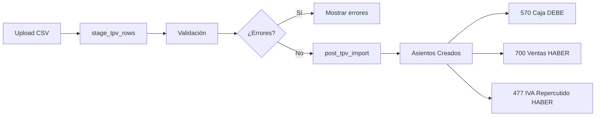
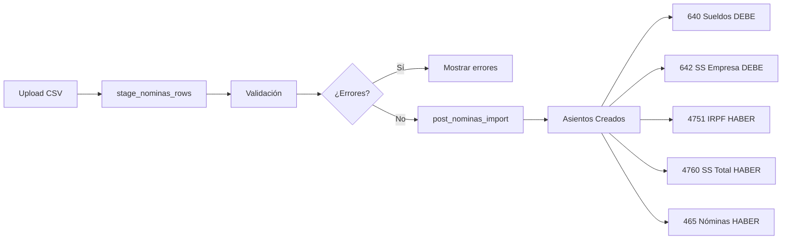

# 📥 Fase 4: Importadores TPV y Nóminas

## ✅ Implementación Completada

Se han creado **2 nuevos módulos de importación** para la suite FranquiConta:

### 1️⃣ **TPV (Ventas por Canal)**
- Importación de ventas McDonald's segmentadas por canal
- Validación automática de canales permitidos
- Asientos contables automáticos (570 vs 700 + 477)

### 2️⃣ **Nóminas (Gastos de Personal)**
- Importación de nóminas con desglose PGC
- Validación de coherencia bruto >= neto
- Asientos contables automáticos (640 + 642 vs 475 + 476 + 465)

---

## 📋 Cambios Realizados

### **Archivos Modificados:**

#### `src/hooks/useImportRun.ts`
- ✅ Extendido tipo `ImportModule` para incluir `'tpv' | 'nominas'`
- ✅ Añadidos hooks:
  - `useStageTVPRows()`
  - `useStageNominasRows()`
  - `usePostTVPImport()`
  - `usePostNominasImport()`

#### `src/pages/accounting/Imports.tsx`
- ✅ Integrados nuevos módulos en tabs UI
- ✅ Añadidos `<TabsTrigger>` para TPV y Nóminas
- ✅ Añadidos `<TabsContent>` con descripción de campos esperados
- ✅ Conectados hooks de staging y posting

---

## 🗄️ Migración SQL Pendiente

⚠️ **ACCIÓN REQUERIDA:** Ejecutar migración manualmente en **Supabase SQL Editor**

### Ubicación:
```
docs/migrations/20250111000003_add_tpv_payroll_staging.sql
```

### Contenido:
1. **Tabla `stg_tpv`** → Staging ventas por canal
2. **Tabla `stg_nominas`** → Staging gastos de personal
3. **RPC `stage_tpv_rows`** → Validación y carga TPV
4. **RPC `stage_nominas_rows`** → Validación y carga nóminas
5. **RPC `post_tpv_import`** → Contabilización TPV
6. **RPC `post_nominas_import`** → Contabilización nóminas
7. **Índices** → Optimización de consultas (10 índices)
8. **RLS Policies** → Seguridad Row Level

### Pasos para ejecutar:
1. Abrir **Supabase Dashboard** → SQL Editor
2. Copiar contenido de `docs/migrations/20250111000003_add_tpv_payroll_staging.sql`
3. Ejecutar SQL completo
4. Verificar que no hay errores
5. Regenerar tipos de Supabase (`npx supabase gen types typescript`)

---

## 📄 Plantillas CSV de Ejemplo

### **TPV (Ventas por Canal)**
📁 `docs/templates/template_tpv.csv`

**Campos obligatorios:**
- `fecha` (DATE): Fecha de venta
- `centro_code` (TEXT): Código del restaurante
- `canal` (TEXT): `dine_in` | `drive_thru` | `delivery` | `takeaway` | `mccafe` | `kiosk`
- `ventas_netas` (NUMERIC): Importe sin IVA

**Campos opcionales:**
- `iva_repercutido` (NUMERIC)
- `turno` (TEXT): `breakfast` | `lunch` | `dinner` | `late_night`
- `num_transacciones` (INTEGER)
- `ticket_medio` (NUMERIC)
- `food_sales`, `beverage_sales`, `dessert_sales` (NUMERIC)

---

### **Nóminas (Gastos de Personal)**
📁 `docs/templates/template_nominas.csv`

**Campos obligatorios:**
- `fecha` (DATE): Fecha de contabilización
- `centro_code` (TEXT): Código del restaurante
- `importe_bruto` (NUMERIC): Coste total empresa
- `importe_neto` (NUMERIC): A pagar al empleado

**Campos opcionales:**
- `empleado_nif` (TEXT)
- `empleado_nombre` (TEXT)
- `sueldos_salarios` (NUMERIC): Cuenta 640
- `seguridad_social_cargo` (NUMERIC): Cuenta 642
- `retencion_irpf` (NUMERIC): Cuenta 4751
- `seguridad_social_empleado` (NUMERIC): Cuenta 4760
- `periodo_liquidacion` (TEXT): Formato `YYYY-MM`
- `tipo_nomina` (TEXT): `mensual` | `extraordinaria` | `finiquito`

---

## 🔗 Flujo de Importación

### **TPV:**


### **Nóminas:**


---

## 🧪 Validaciones Implementadas

### **TPV:**
✅ Canal válido (6 opciones)  
✅ Ventas netas > 0  
✅ Fecha válida  
✅ Centro existe  
✅ Deduplicación por hash

### **Nóminas:**
✅ Importe bruto > 0  
✅ Importe neto > 0  
✅ Bruto >= Neto  
✅ Fecha válida  
✅ Centro existe  
✅ Deduplicación por hash

---

## 📊 Asientos Contables Generados

### **TPV - Ventas por Canal:**
```
DEBE                           HABER
──────────────────────────────────────────
570 Caja           3,025.00
                              700 Ventas                 2,500.00
                              477 IVA Repercutido          525.00
──────────────────────────────────────────
TOTAL              3,025.00   TOTAL                      3,025.00
```

### **Nóminas - Gastos de Personal:**
```
DEBE                           HABER
──────────────────────────────────────────
640 Sueldos        2,000.00
642 SS Empresa       660.00
                              4751 IRPF                    280.00
                              4760 SS Total                792.00
                              465 Nóminas a pagar        2,298.00
──────────────────────────────────────────
TOTAL              2,660.00   TOTAL                      2,660.00
```

---

## 🎯 Próximos Pasos Sugeridos

Una vez ejecutada la migración SQL:

### **Fase 5: Testing Crítico**
- Tests unitarios para `vat-utils.ts`
- Tests unitarios para `fiscal-normalizer.ts`
- Tests de integración para flujo OCR completo

### **Fase 6: Métricas Avanzadas (Mindee)**
- ✅ Gráficos temporales (evolución mensual)
- ✅ Desglose por proveedor (top errores OCR)
- ✅ Métricas Mindee integradas en UI
- ✅ Confianza promedio por proveedor
- ✅ Coste acumulado de procesamiento OCR
- 🔄 ROI calculator (ahorro tiempo/€) - En desarrollo

### **Fase 7: Catálogos Geográficos**
- Página `/admin/catalogos-geo`
- CRUD completo para países, provincias, municipios, CPs
- Importación masiva desde INE

---

## 📚 Documentación Adicional

- **Convenciones PGC:** `docs/custom-knowledge.md`
- **Arquitectura SQL:** `supabase/migrations/`
- **Hooks React Query:** `src/hooks/useImportRun.ts`
- **UI Components:** `src/components/imports/`

---

## ✅ Checklist de Implementación

- [x] Extender tipo `ImportModule` en `useImportRun.ts`
- [x] Crear hooks `useStageTVPRows`, `useStageNominasRows`
- [x] Crear hooks `usePostTVPImport`, `usePostNominasImport`
- [x] Integrar tabs en `Imports.tsx`
- [x] Crear migración SQL completa
- [x] Crear plantillas CSV de ejemplo
- [x] Documentar flujo de importación
- [ ] **PENDIENTE:** Ejecutar migración SQL en Supabase
- [ ] **PENDIENTE:** Regenerar tipos TypeScript de Supabase
- [ ] **PENDIENTE:** Probar importación TPV con plantilla
- [ ] **PENDIENTE:** Probar importación Nóminas con plantilla

---

**Estado:** ✅ **Implementación completa** (requiere ejecución manual de migración SQL)

**Tiempo estimado ejecución SQL:** 2-3 minutos

**Documentación generada:** 2025-01-11

---

## 🤖 Estado de OCR Mindee

**Motor actual:** Mindee Invoice API (exclusivo desde Enero 2025)

**Migración completada:**
- ❌ OpenAI GPT-4 Vision → Descontinuado
- ✅ Mindee Invoice API → Activo y operativo
- ✅ Parsers de fallback europeos → Implementados
- ✅ Detección de proveedores críticos → Activa (Havi)

**Facturas históricas OpenAI:**
- Siguen visibles con badge "OpenAI (Legacy)"
- Datos históricos se mantienen para análisis
- Filtros permiten comparación de calidad OCR
