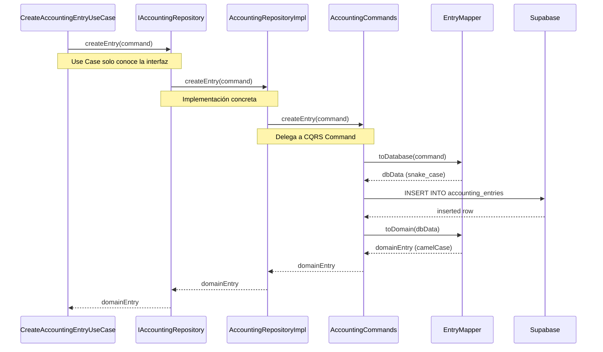

# 📦 Repository Pattern + CQRS

## ¿Qué es el Repository Pattern?

El **Repository Pattern** abstrae la persistencia de datos, permitiendo que el dominio y los casos de uso no dependan de tecnologías específicas (Supabase, MongoDB, PostgreSQL, etc.).

**Ventaja principal:** Cambiar la base de datos o el ORM sin afectar la lógica de negocio.

---

## Diagrama de Implementación

```mermaid
graph LR
    subgraph "Application Layer"
        UC[CreateAccountingEntry<br/>UseCase]
    end
    
    subgraph "Domain Layer"
        IRepo[IAccountingRepository<br/>interface]
    end
    
    subgraph "Infrastructure Layer"
        Repo[AccountingRepositoryImpl]
    end
    
    subgraph "CQRS Layer"
        Queries[AccountingQueries<br/>SELECT only]
        Commands[AccountingCommands<br/>INSERT/UPDATE/DELETE]
    end
    
    subgraph "Mappers"
        Mappers[EntryMapper<br/>DTO ↔ Domain]
    end
    
    subgraph "Database"
        DB[(Supabase<br/>PostgreSQL)]
    end
    
    UC -->|depends on| IRepo
    Repo -->|implements| IRepo
    Repo -->|delegates read| Queries
    Repo -->|delegates write| Commands
    Queries -->|uses| Mappers
    Commands -->|uses| Mappers
    Mappers -->|talks to| DB
    
    style UC fill:#fff4e6
    style IRepo fill:#f3e8ff
    style Repo fill:#e8f5e9
    style Queries fill:#e1f5ff
    style Commands fill:#ffe8e8
    style Mappers fill:#fff9c4
```

---

## Implementación en FranquiConta

### **1. Interfaz (Contrato en Domain Layer)**

La interfaz define **qué** operaciones son posibles, sin especificar **cómo**.

```typescript
// src/domain/accounting/repositories/IAccountingRepository.ts

import type { JournalEntry } from '../types';

export interface IAccountingRepository {
  // ========================================================================
  // QUERIES (Lectura)
  // ========================================================================
  
  /**
   * Buscar asiento por ID
   */
  findEntryById(id: string): Promise<JournalEntry | null>;
  
  /**
   * Buscar asientos con filtros
   */
  findEntries(filters: EntryFilters): Promise<JournalEntry[]>;
  
  /**
   * Obtener balance de sumas y saldos
   */
  getTrialBalance(centroCode: string, dateFrom: string, dateTo: string): Promise<TrialBalance>;
  
  // ========================================================================
  // COMMANDS (Escritura)
  // ========================================================================
  
  /**
   * Crear nuevo asiento
   */
  createEntry(command: CreateEntryCommand): Promise<JournalEntry>;
  
  /**
   * Actualizar asiento
   */
  updateEntry(id: string, command: UpdateEntryCommand): Promise<JournalEntry>;
  
  /**
   * Contabilizar asiento (cambiar estado a 'posted')
   */
  postEntry(id: string, userId: string): Promise<void>;
  
  /**
   * Eliminar asiento (solo borradores)
   */
  deleteEntry(id: string): Promise<void>;
}

// Tipos auxiliares
export interface EntryFilters {
  centroCode?: string;
  dateFrom?: string;
  dateTo?: string;
  status?: 'draft' | 'posted';
  accountCode?: string;
}

export interface CreateEntryCommand {
  centroCode: string;
  entryDate: string;
  description: string;
  transactions: Array<{
    accountCode: string;
    debit: number;
    credit: number;
    description?: string;
  }>;
  createdBy: string;
}
```

**Ventajas:**
- ✅ **Testeable:** Los Use Cases pueden usar mocks de la interfaz
- ✅ **Flexible:** Cambiar implementación sin tocar Use Cases
- ✅ **Documentación:** La interfaz es el contrato del dominio

---

### **2. Implementación Concreta (Infrastructure Layer)**

La implementación delega a **Commands** y **Queries** especializados.

```typescript
// src/infrastructure/persistence/supabase/repositories/AccountingRepositoryImpl.ts

import type { IAccountingRepository } from '@/domain/accounting/repositories/IAccountingRepository';
import { AccountingQueries } from '../queries/AccountingQueries';
import { AccountingCommands } from '../commands/AccountingCommands';

export class AccountingRepositoryImpl implements IAccountingRepository {
  // ========================================================================
  // QUERIES: Delegar a AccountingQueries
  // ========================================================================
  
  async findEntryById(id: string): Promise<JournalEntry | null> {
    return AccountingQueries.findEntryById(id);
  }
  
  async findEntries(filters: EntryFilters): Promise<JournalEntry[]> {
    return AccountingQueries.findEntries(filters);
  }
  
  async getTrialBalance(centroCode: string, dateFrom: string, dateTo: string): Promise<TrialBalance> {
    return AccountingQueries.getTrialBalance(centroCode, dateFrom, dateTo);
  }
  
  // ========================================================================
  // COMMANDS: Delegar a AccountingCommands
  // ========================================================================
  
  async createEntry(command: CreateEntryCommand): Promise<JournalEntry> {
    return AccountingCommands.createEntry(command);
  }
  
  async updateEntry(id: string, command: UpdateEntryCommand): Promise<JournalEntry> {
    return AccountingCommands.updateEntry(id, command);
  }
  
  async postEntry(id: string, userId: string): Promise<void> {
    return AccountingCommands.postEntry(id, userId);
  }
  
  async deleteEntry(id: string): Promise<void> {
    return AccountingCommands.deleteEntry(id);
  }
}
```

**Ventajas:**
- ✅ **Single Responsibility:** Repository solo orquesta, no implementa lógica
- ✅ **CQRS:** Separación clara entre Commands y Queries
- ✅ **Mantenibilidad:** Cambios en queries no afectan commands

---

### **3. CQRS: Queries (Solo Lectura)**

Las **Queries** están optimizadas para **lectura** (SELECT) con joins, agregaciones, etc.

```typescript
// src/infrastructure/persistence/supabase/queries/AccountingQueries.ts

import { supabase } from '@/integrations/supabase/client';
import { EntryMapper } from '../mappers/EntryMapper';
import type { JournalEntry } from '@/domain/accounting/types';

export class AccountingQueries {
  /**
   * Buscar asiento por ID con sus transacciones
   */
  static async findEntryById(id: string): Promise<JournalEntry | null> {
    const { data, error } = await supabase
      .from('accounting_entries')
      .select(`
        *,
        transactions:accounting_transactions(*)
      `)
      .eq('id', id)
      .single();
    
    if (error || !data) return null;
    
    return EntryMapper.toDomain(data);
  }
  
  /**
   * Buscar asientos con filtros complejos
   */
  static async findEntries(filters: EntryFilters): Promise<JournalEntry[]> {
    let query = supabase
      .from('accounting_entries')
      .select(`
        *,
        transactions:accounting_transactions(*)
      `);
    
    // Aplicar filtros dinámicamente
    if (filters.centroCode) {
      query = query.eq('centro_code', filters.centroCode);
    }
    
    if (filters.dateFrom) {
      query = query.gte('entry_date', filters.dateFrom);
    }
    
    if (filters.dateTo) {
      query = query.lte('entry_date', filters.dateTo);
    }
    
    if (filters.status) {
      query = query.eq('status', filters.status);
    }
    
    const { data, error } = await query.order('entry_date', { ascending: false });
    
    if (error || !data) return [];
    
    return data.map(EntryMapper.toDomain);
  }
  
  /**
   * Obtener balance de sumas y saldos (query complejo)
   */
  static async getTrialBalance(
    centroCode: string, 
    dateFrom: string, 
    dateTo: string
  ): Promise<TrialBalance> {
    // Usar RPC de Supabase para query complejo
    const { data, error } = await supabase.rpc('calculate_trial_balance', {
      p_centro_code: centroCode,
      p_date_from: dateFrom,
      p_date_to: dateTo,
    });
    
    if (error) throw new Error(`Error calculating trial balance: ${error.message}`);
    
    return data;
  }
}
```

**Características de Queries:**
- ✅ **Optimizadas para lectura:** Joins complejos, agregaciones
- ✅ **Sin side-effects:** No modifican datos
- ✅ **Cacheables:** Pueden usar React Query con staleTime
- ✅ **Especializadas:** Queries específicos para cada pantalla

---

### **4. CQRS: Commands (Solo Escritura)**

Los **Commands** se enfocan en **escribir** (INSERT/UPDATE/DELETE) con validaciones.

```typescript
// src/infrastructure/persistence/supabase/commands/AccountingCommands.ts

import { supabase } from '@/integrations/supabase/client';
import { EntryMapper } from '../mappers/EntryMapper';
import type { JournalEntry, CreateEntryCommand } from '@/domain/accounting/types';

export class AccountingCommands {
  /**
   * Crear nuevo asiento contable
   */
  static async createEntry(command: CreateEntryCommand): Promise<JournalEntry> {
    // Mapear de Domain a Database
    const dbData = EntryMapper.toDatabase(command);
    
    const { data, error } = await supabase
      .from('accounting_entries')
      .insert(dbData)
      .select(`
        *,
        transactions:accounting_transactions(*)
      `)
      .single();
    
    if (error) throw new Error(`Error creating entry: ${error.message}`);
    
    // Mapear de Database a Domain
    return EntryMapper.toDomain(data);
  }
  
  /**
   * Actualizar asiento (solo borradores)
   */
  static async updateEntry(id: string, command: UpdateEntryCommand): Promise<JournalEntry> {
    const dbData = EntryMapper.toDatabase(command);
    
    const { data, error } = await supabase
      .from('accounting_entries')
      .update(dbData)
      .eq('id', id)
      .eq('status', 'draft') // Solo borradores
      .select(`
        *,
        transactions:accounting_transactions(*)
      `)
      .single();
    
    if (error) throw new Error(`Error updating entry: ${error.message}`);
    
    return EntryMapper.toDomain(data);
  }
  
  /**
   * Contabilizar asiento (cambiar estado a 'posted')
   */
  static async postEntry(id: string, userId: string): Promise<void> {
    const { error } = await supabase
      .from('accounting_entries')
      .update({
        status: 'posted',
        posted_at: new Date().toISOString(),
        posted_by: userId,
      })
      .eq('id', id)
      .eq('status', 'draft'); // Solo borradores
    
    if (error) throw new Error(`Error posting entry: ${error.message}`);
  }
  
  /**
   * Eliminar asiento (solo borradores)
   */
  static async deleteEntry(id: string): Promise<void> {
    const { error } = await supabase
      .from('accounting_entries')
      .delete()
      .eq('id', id)
      .eq('status', 'draft'); // Solo borradores
    
    if (error) throw new Error(`Error deleting entry: ${error.message}`);
  }
}
```

**Características de Commands:**
- ✅ **Transaccionales:** Usan transacciones cuando es necesario
- ✅ **Validaciones:** Verifican reglas de negocio antes de escribir
- ✅ **Auditables:** Registran quién y cuándo modificó
- ✅ **Idempotentes:** Evitan duplicados (ej. `import_batch_id`)

---

### **5. Mappers: Conversión DTO ↔ Domain**

Los **Mappers** convierten entre representaciones de base de datos y objetos de dominio.

```typescript
// src/infrastructure/persistence/supabase/mappers/EntryMapper.ts

import type { JournalEntry } from '@/domain/accounting/types';

export class EntryMapper {
  /**
   * Convertir de DB (snake_case) a Domain (camelCase)
   */
  static toDomain(dbEntry: any): JournalEntry {
    return {
      id: dbEntry.id,
      centroCode: dbEntry.centro_code,
      entryDate: dbEntry.entry_date,
      description: dbEntry.description,
      status: dbEntry.status,
      totalDebit: dbEntry.total_debit,
      totalCredit: dbEntry.total_credit,
      createdBy: dbEntry.created_by,
      createdAt: dbEntry.created_at,
      postedAt: dbEntry.posted_at,
      postedBy: dbEntry.posted_by,
      transactions: dbEntry.transactions?.map((tx: any) => ({
        id: tx.id,
        accountCode: tx.account_code,
        debit: tx.debit,
        credit: tx.credit,
        description: tx.description,
      })) || [],
    };
  }
  
  /**
   * Convertir de Domain (camelCase) a DB (snake_case)
   */
  static toDatabase(entry: Partial<JournalEntry>): any {
    return {
      centro_code: entry.centroCode,
      entry_date: entry.entryDate,
      description: entry.description,
      status: entry.status,
      total_debit: entry.totalDebit,
      total_credit: entry.totalCredit,
      created_by: entry.createdBy,
      posted_at: entry.postedAt,
      posted_by: entry.postedBy,
    };
  }
}
```

**Ventajas de Mappers:**
- ✅ **Desacoplamiento:** DB y Domain usan convenciones diferentes
- ✅ **Testeable:** Fácil validar transformaciones
- ✅ **Centralizado:** Un solo lugar para cambios de formato

---

## Flujo Completo: Create Entry



---

## Testing con Repository Pattern

### **Unit Test: Mock de Repository**

```typescript
describe('PostEntryUseCase', () => {
  it('debe contabilizar asiento correctamente', async () => {
    // Arrange: Mock del repository
    const mockRepo: IAccountingRepository = {
      postEntry: vi.fn().mockResolvedValue(undefined),
      findEntryById: vi.fn().mockResolvedValue({
        id: 'entry-123',
        status: 'draft',
      }),
    };
    
    const useCase = new PostEntryUseCase(mockRepo);
    
    // Act
    await useCase.execute({ entryId: 'entry-123', userId: 'user-456' });
    
    // Assert
    expect(mockRepo.postEntry).toHaveBeenCalledWith('entry-123', 'user-456');
  });
});
```

### **Integration Test: Repository Real**

```typescript
describe('AccountingRepositoryImpl', () => {
  it('debe crear asiento con transacciones', async () => {
    const repo = new AccountingRepositoryImpl();
    
    const entry = await repo.createEntry({
      centroCode: 'C001',
      entryDate: '2025-01-15',
      description: 'Test entry',
      transactions: [
        { accountCode: '6000000', debit: 100, credit: 0 },
        { accountCode: '5720000', debit: 0, credit: 100 },
      ],
      createdBy: 'test-user',
    });
    
    expect(entry.id).toBeDefined();
    expect(entry.transactions.length).toBe(2);
  });
});
```

---

## Comparación: Con vs Sin Repository Pattern

### ❌ Sin Repository Pattern (Acoplado a Supabase)

```typescript
// Use Case acoplado directamente a Supabase
export class PostEntryUseCase {
  async execute(input: PostEntryInput) {
    const { data } = await supabase
      .from('accounting_entries')
      .update({ status: 'posted' })
      .eq('id', input.entryId);
    
    return data;
  }
}

// Problemas:
// ❌ No testeable sin BD real
// ❌ Difícil cambiar de BD
// ❌ Lógica de BD mezclada con lógica de negocio
```

### ✅ Con Repository Pattern (Desacoplado)

```typescript
// Use Case depende de abstracción
export class PostEntryUseCase {
  constructor(private repository: IAccountingRepository) {}
  
  async execute(input: PostEntryInput) {
    // Validar
    const entry = await this.repository.findEntryById(input.entryId);
    if (entry.status !== 'draft') {
      throw new Error('Solo se pueden contabilizar borradores');
    }
    
    // Contabilizar
    await this.repository.postEntry(input.entryId, input.userId);
  }
}

// Ventajas:
// ✅ Testeable con mocks
// ✅ Cambiar BD sin tocar Use Case
// ✅ Lógica de negocio pura
```

---

## Resumen

| Componente | Responsabilidad | Ubicación |
|------------|-----------------|-----------|
| **Interface** | Definir contrato | `domain/repositories/` |
| **Implementation** | Orquestar Commands/Queries | `infrastructure/repositories/` |
| **Queries** | SELECT (lectura) | `infrastructure/queries/` |
| **Commands** | INSERT/UPDATE/DELETE | `infrastructure/commands/` |
| **Mappers** | DTO ↔ Domain | `infrastructure/mappers/` |

**Regla de oro:** El dominio nunca importa nada de infrastructure.
