# 🧪 Estrategia de Testing

## Pirámide de Tests

```mermaid
graph TB
    subgraph "🧪 Test Pyramid"
        E2E["E2E Tests (9 tests)<br/>Flujos completos multi-capa<br/>invoice-approval-flow<br/>bank-reconciliation-flow<br/>period-closing-flow"]
        Integration["Integration Tests (Futuro)<br/>Repository + DB real<br/>Edge Functions + Supabase"]
        Unit["Unit Tests (130+ tests)<br/>Services, Use Cases, Mappers<br/>EntryValidator, BalanceCalculator<br/>Norma43Parser, ApprovalEngine"]
    end
    
    Unit --> Integration
    Integration --> E2E
    
    style Unit fill:#c8e6c9,color:#000
    style Integration fill:#fff9c4,color:#000
    style E2E fill:#e1f5ff,color:#000
```



**Distribución recomendada:**
- **70%** Unit Tests (rápidos, aislados, muchos)
- **20%** Integration Tests (base de datos, APIs)
- **10%** E2E Tests (flujos críticos completos)

---

## Tipos de Tests

### **1. Unit Tests (130+ tests)**

**Objetivo:** Testear funciones/clases **aisladas** sin dependencias externas.

**Características:**
- ✅ **Rápidos:** < 1 segundo por test
- ✅ **Aislados:** Sin BD, sin red, sin filesystem
- ✅ **Determinísticos:** Siempre el mismo resultado
- ✅ **Muchos:** Cubrir todos los edge cases

**Qué se testea:**
- Domain Services (EntryValidator, PGCValidator, BalanceCalculator)
- Value Objects (AccountCode, Money)
- Parsers (Norma43Parser)
- Mappers (EntryMapper, InvoiceMapper)
- Use Cases (con mocks de repositories)

**Stack:**
- **Vitest** (test runner)
- **Testing Library** (para componentes React)
- **vi.spyOn()** / **vi.fn()** (mocks)

**Ejemplo:**

```typescript
// src/domain/accounting/services/__tests__/EntryValidator.test.ts

import { describe, it, expect } from 'vitest';
import { EntryValidator } from '../EntryValidator';

describe('EntryValidator', () => {
  it('debe validar que debe = haber', () => {
    // Arrange
    const entry = {
      transactions: [
        { debit: 100, credit: 0 },
        { debit: 0, credit: 50 }, // ❌ Descuadrado
      ],
    };
    
    // Act
    const result = EntryValidator.validateBalance(entry.transactions);
    
    // Assert
    expect(result.valid).toBe(false);
    expect(result.errors).toContain('Asiento descuadrado: debe (100) ≠ haber (50)');
  });
  
  it('debe validar códigos de cuenta PGC válidos', () => {
    const result = EntryValidator.validateAccountCode('6000000');
    expect(result.valid).toBe(true);
  });
  
  it('debe rechazar códigos de cuenta inválidos', () => {
    const result = EntryValidator.validateAccountCode('99999'); // Solo 5 dígitos
    expect(result.valid).toBe(false);
    expect(result.errors).toContain('Código de cuenta debe tener 7 dígitos');
  });
});
```

**Comando:**
```bash
npm test -- EntryValidator
```

---

### **2. Integration Tests E2E (9 tests)**

**Objetivo:** Validar **flujos completos** multi-capa (UI → Domain → Infrastructure → DB).

**Características:**
- ✅ **Realistas:** Simula comportamiento real del usuario
- ✅ **Multi-capa:** Testea Use Cases + Repositories + BD (mockada)
- ✅ **Críticos:** Solo flujos principales del negocio
- ❌ **Lentos:** 1-5 segundos por test

**Qué se testea:**
- Flujo completo de factura: Crear → Aprobar (manager) → Aprobar (accounting) → Asiento → Contabilizar
- Flujo completo de conciliación: Importar Norma43 → Sugerir matches → Conciliar → Asiento
- Flujo completo de cierre: Crear asientos → Contabilizar → Cerrar período

**Stack:**
- **Vitest** (test runner)
- **Mocks de Supabase** (simular BD)
- **Test Data Builders** (helpers de datos de test)

**Ejemplo:**

```typescript
// src/domain/__tests__/integration/invoice-approval-flow.test.ts

import { describe, it, expect, vi } from 'vitest';
import { CreateInvoiceReceivedUseCase } from '@/domain/invoicing/use-cases/CreateInvoiceReceived';
import { ApproveInvoiceUseCase } from '@/domain/invoicing/use-cases/ApproveInvoice';
import { CreateAccountingEntryUseCase } from '@/domain/accounting/use-cases/CreateAccountingEntry';
import { PostEntryUseCase } from '@/domain/accounting/use-cases/PostEntry';

describe('E2E: Flujo completo de Factura → Aprobación → Asiento', () => {
  it('debe procesar factura desde creación hasta contabilización', async () => {
    // ========================================================================
    // STEP 1: Create Invoice
    // ========================================================================
    const createInvoiceUseCase = new CreateInvoiceReceivedUseCase();
    const invoice = await createInvoiceUseCase.execute({
      invoice: {
        supplierId: 'supplier-123',
        invoiceNumber: 'F2025-001',
        totalWithVat: 1210.00,
      },
      lines: [{ description: 'Producto 1', quantity: 10, unitPrice: 100, vatRate: 21 }],
    });
    
    expect(invoice.invoice.approvalStatus).toBe('draft');
    
    // ========================================================================
    // STEP 2: Manager Approval
    // ========================================================================
    const approveUseCase = new ApproveInvoiceUseCase();
    await approveUseCase.execute({
      invoice: invoice.invoice,
      approverUserId: 'manager-123',
      approvalLevel: 'manager',
    });
    
    // Verify status changed
    expect(invoice.invoice.approvalStatus).toBe('pending_accounting');
    
    // ========================================================================
    // STEP 3: Accounting Approval
    // ========================================================================
    await approveUseCase.execute({
      invoice: invoice.invoice,
      approverUserId: 'accountant-123',
      approvalLevel: 'accounting',
    });
    
    expect(invoice.invoice.approvalStatus).toBe('approved');
    
    // ========================================================================
    // STEP 4: Generate Accounting Entry
    // ========================================================================
    const createEntryUseCase = new CreateAccountingEntryUseCase();
    const entry = await createEntryUseCase.execute({
      centroCode: 'C001',
      entryDate: '2025-01-15',
      description: `Factura ${invoice.invoice.invoiceNumber}`,
      transactions: [
        { accountCode: '6000000', debit: 1000, credit: 0 },
        { accountCode: '4720001', debit: 210, credit: 0 },
        { accountCode: '4000000', debit: 0, credit: 1210 },
      ],
      createdBy: 'accountant-123',
    });
    
    expect(entry.entry.status).toBe('draft');
    
    // ========================================================================
    // STEP 5: Post Entry
    // ========================================================================
    const postUseCase = new PostEntryUseCase();
    await postUseCase.execute({
      entryId: entry.entry.id,
      userId: 'accountant-123',
    });
    
    // ========================================================================
    // FINAL VERIFICATION
    // ========================================================================
    expect(invoice.invoice.approvalStatus).toBe('approved');
    expect(entry.entry.status).toBe('posted');
  });
});
```

**Comando:**
```bash
npm test -- integration
```

---

### **3. Component Tests (Futuro)**

**Objetivo:** Testear **componentes React** aislados con mocks de hooks.

**Ejemplo:**

```typescript
// src/components/accounting/__tests__/AccountingEntryForm.test.tsx

import { render, screen, fireEvent } from '@testing-library/react';
import { describe, it, expect, vi } from 'vitest';
import { AccountingEntryForm } from '../AccountingEntryForm';

describe('AccountingEntryForm', () => {
  it('debe validar que debe = haber antes de enviar', async () => {
    const onSubmit = vi.fn();
    
    render(<AccountingEntryForm onSubmit={onSubmit} />);
    
    // Fill form
    fireEvent.change(screen.getByLabelText('Cuenta debe'), { target: { value: '6000000' } });
    fireEvent.change(screen.getByLabelText('Importe debe'), { target: { value: '100' } });
    fireEvent.change(screen.getByLabelText('Cuenta haber'), { target: { value: '5720000' } });
    fireEvent.change(screen.getByLabelText('Importe haber'), { target: { value: '50' } }); // ❌ Descuadrado
    
    // Submit
    fireEvent.click(screen.getByText('Crear Asiento'));
    
    // Verify error shown
    expect(await screen.findByText(/descuadrado/i)).toBeInTheDocument();
    expect(onSubmit).not.toHaveBeenCalled();
  });
});
```

---

## Configuración de Vitest

```typescript
// vitest.config.ts

import { defineConfig } from 'vitest/config';
import react from '@vitejs/plugin-react';
import path from 'path';

export default defineConfig({
  plugins: [react()],
  test: {
    globals: true,
    environment: 'jsdom',
    setupFiles: ['./src/test/setup.ts'],
    coverage: {
      provider: 'v8',
      reporter: ['text', 'json', 'html'],
      exclude: [
        'node_modules/',
        'src/test/',
        '**/*.d.ts',
        '**/*.config.*',
        '**/mockData',
        'src/integrations/supabase/types.ts', // Generated file
      ],
      // Thresholds
      lines: 80,
      functions: 80,
      branches: 75,
      statements: 80,
    },
  },
  resolve: {
    alias: {
      '@': path.resolve(__dirname, './src'),
    },
  },
});
```

**Setup file:**

```typescript
// src/test/setup.ts

import { expect, afterEach, vi } from 'vitest';
import { cleanup } from '@testing-library/react';
import * as matchers from '@testing-library/jest-dom/matchers';

// Extend Vitest's expect with jest-dom matchers
expect.extend(matchers);

// Cleanup after each test
afterEach(() => {
  cleanup();
});

// Mock window.matchMedia
Object.defineProperty(window, 'matchMedia', {
  writable: true,
  value: vi.fn().mockImplementation(query => ({
    matches: false,
    media: query,
    onchange: null,
    addListener: vi.fn(),
    removeListener: vi.fn(),
    addEventListener: vi.fn(),
    removeEventListener: vi.fn(),
    dispatchEvent: vi.fn(),
  })),
});
```

---

## Comandos de Testing

```bash
# Ejecutar todos los tests
npm test

# Tests en modo watch (desarrollo)
npm run test:watch

# Tests con cobertura
npm run test:coverage

# Solo tests unitarios (excluir integration)
npm test -- --exclude src/domain/__tests__/integration

# Solo tests de integración E2E
npm test -- src/domain/__tests__/integration

# Solo tests de un archivo específico
npm test -- EntryValidator

# Tests con UI interactiva (Vitest UI)
npm run test:ui
```

---

## Estrategia de Mocking

### **1. Mock de Repositories (Use Cases)**

```typescript
describe('PostEntryUseCase', () => {
  it('debe contabilizar asiento', async () => {
    // Mock del repository
    const mockRepo: IAccountingRepository = {
      findEntryById: vi.fn().mockResolvedValue({ id: '123', status: 'draft' }),
      postEntry: vi.fn().mockResolvedValue(undefined),
    };
    
    const useCase = new PostEntryUseCase(mockRepo);
    await useCase.execute({ entryId: '123', userId: 'user-456' });
    
    expect(mockRepo.postEntry).toHaveBeenCalledWith('123', 'user-456');
  });
});
```

### **2. Mock de Supabase (Commands/Queries)**

```typescript
import { vi } from 'vitest';
import { supabase } from '@/integrations/supabase/client';

vi.mock('@/integrations/supabase/client', () => ({
  supabase: {
    from: vi.fn(() => ({
      select: vi.fn().mockReturnThis(),
      insert: vi.fn().mockReturnThis(),
      update: vi.fn().mockReturnThis(),
      eq: vi.fn().mockReturnThis(),
      single: vi.fn(() => Promise.resolve({ data: mockData, error: null })),
    })),
  },
}));
```

### **3. Spy en Métodos Estáticos (Commands)**

```typescript
import { InvoiceCommands } from '@/infrastructure/persistence/supabase/commands/InvoiceCommands';

// Spy en método estático
const updateSpy = vi.spyOn(InvoiceCommands, 'updateInvoiceReceived')
  .mockResolvedValue(mockInvoice as any);

// Verify call
expect(updateSpy).toHaveBeenCalledWith(
  invoice.id,
  expect.objectContaining({ approvalStatus: 'approved' })
);
```

---

## Métricas de Cobertura

### **Objetivo de Cobertura**

| Métrica | Objetivo | Actual |
|---------|----------|--------|
| **Lines** | 90% | 85% |
| **Functions** | 85% | 82% |
| **Branches** | 80% | 78% |
| **Statements** | 90% | 85% |

### **Áreas Críticas (100% de cobertura)**

- ✅ Domain Services (EntryValidator, PGCValidator, BalanceCalculator)
- ✅ Use Cases (CreateAccountingEntry, ApproveInvoice, PostEntry)
- ✅ Value Objects (AccountCode, Money)
- ✅ Parsers (Norma43Parser)

### **Áreas No Críticas (70-80% de cobertura)**

- Mappers (EntryMapper, InvoiceMapper)
- Queries (AccountingQueries, InvoiceQueries)
- UI Components (cobertura más baja, prioridad en E2E)

---

## Debugging de Tests

### **Ver output detallado**

```bash
npm test -- --reporter=verbose
```

### **Debug en VS Code**

```json
// .vscode/launch.json
{
  "version": "0.2.0",
  "configurations": [
    {
      "type": "node",
      "request": "launch",
      "name": "Debug Vitest Tests",
      "runtimeExecutable": "npm",
      "runtimeArgs": ["test", "--", "--run"],
      "console": "integratedTerminal",
      "internalConsoleOptions": "neverOpen"
    }
  ]
}
```

### **Modo watch con filtro**

```bash
npm test -- --watch EntryValidator
```

---

## CI/CD Integration

```yaml
# .github/workflows/tests.yml

name: Tests
on: [push, pull_request]

jobs:
  test:
    runs-on: ubuntu-latest
    steps:
      - uses: actions/checkout@v3
      - uses: actions/setup-node@v3
        with:
          node-version: 18
      
      - name: Install dependencies
        run: npm install
      
      - name: Run unit tests
        run: npm test -- --exclude src/domain/__tests__/integration
      
      - name: Run integration tests
        run: npm test -- src/domain/__tests__/integration
      
      - name: Generate coverage
        run: npm run test:coverage
      
      - name: Upload coverage to Codecov
        uses: codecov/codecov-action@v3
```

---

## Resumen de Tests Existentes

### **Unit Tests (130+ tests)**

| Domain | Tests | Archivos |
|--------|-------|----------|
| **Accounting** | 45 | EntryValidator, BalanceCalculator, EntryCalculator, PGCValidator, PeriodValidator, CreateAccountingEntry, PostEntry, CloseAccountingPeriod |
| **Invoicing** | 40 | InvoiceValidator, InvoiceCalculator, ApprovalEngine, CreateInvoiceReceived, ApproveInvoice, RejectInvoice |
| **Banking** | 30 | Norma43Parser, ReconciliationEngine, ReconciliationValidator, ImportNorma43File, SuggestReconciliationMatches, ReconcileBankTransaction |
| **Mappers** | 15 | AccountMapper, EntryMapper, InvoiceMapper, SupplierMapper, TransactionMapper |

### **Integration Tests E2E (9 tests)**

| Flujo | Tests | Archivo |
|-------|-------|---------|
| **Invoice Approval** | 3 | invoice-approval-flow.test.ts |
| **Bank Reconciliation** | 3 | bank-reconciliation-flow.test.ts |
| **Period Closing** | 3 | period-closing-flow.test.ts |

---

## Best Practices

✅ **DO:**
- Test comportamiento, no implementación
- Un test = Un concepto
- Nombres descriptivos (`debe validar que debe = haber`)
- Arrange-Act-Assert pattern
- Mock solo lo externo (BD, APIs)

❌ **DON'T:**
- Testear detalles de implementación privados
- Tests con dependencias entre sí
- Tests que requieren orden específico
- Tests con timeouts arbitrarios
- Tests sin asserts claros

---

## Roadmap de Testing

### **FASE 1: Completada ✓**
- ✅ 130+ unit tests (services, use cases, mappers)
- ✅ 9 integration E2E tests (flujos críticos)
- ✅ Configuración Vitest con coverage

### **FASE 2: Q1 2025**
- ⏳ Component tests (React Testing Library)
- ⏳ Visual regression tests (Chromatic/Percy)
- ⏳ Contract tests (API contracts)

### **FASE 3: Q2 2025**
- ⏳ Performance tests (Lighthouse CI)
- ⏳ Accessibility tests (jest-axe)
- ⏳ Security tests (OWASP)

---

## Referencias

- **Vitest**: [vitest.dev](https://vitest.dev)
- **Testing Library**: [testing-library.com](https://testing-library.com)
- **Test Pyramid**: Martin Fowler
- **AAA Pattern**: Arrange-Act-Assert
