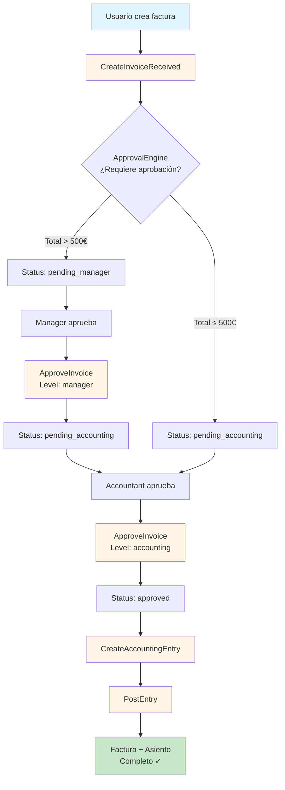
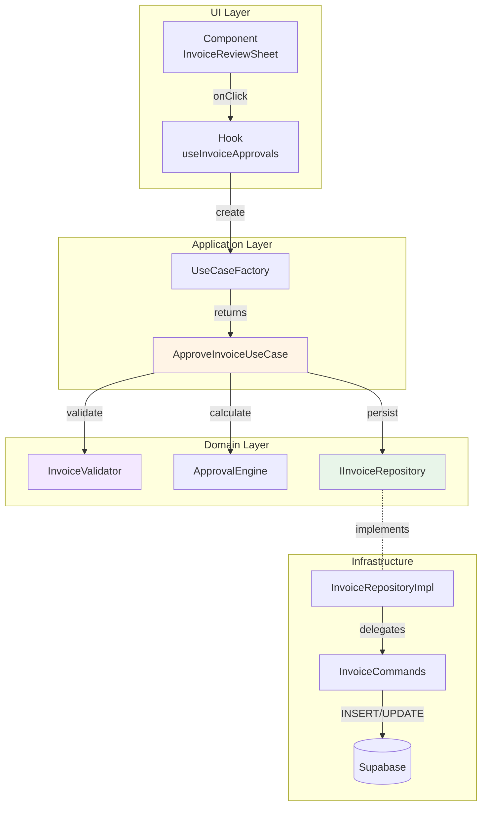

# 📚 Casos de Uso (Use Cases)

## ¿Qué es un Use Case?

Un **Use Case** representa **una acción del usuario** en el sistema. Orquesta servicios del dominio y repositories para cumplir un objetivo de negocio específico.

**Características:**
- ✅ Una responsabilidad única (Single Responsibility Principle)
- ✅ Independiente de UI y BD (depende de abstracciones)
- ✅ Testeable de forma aislada
- ✅ Contiene la lógica de la aplicación (workflow)

---

## Listado Completo de Use Cases

### **🧾 Accounting Domain**

| Use Case | Descripción | Input | Output |
|----------|-------------|-------|--------|
| `CreateAccountingEntry` | Crear asiento contable en borrador | `EntryData` | `JournalEntry` |
| `PostEntry` | Contabilizar asiento (draft → posted) | `EntryId, UserId` | `void` |
| `CloseAccountingPeriod` | Cerrar período mensual/anual | `Year, Month, CentroCode` | `ClosedPeriod` |
| `DeleteEntry` | Eliminar asiento borrador | `EntryId` | `void` |
| `UpdateEntry` | Actualizar asiento borrador | `EntryId, Updates` | `JournalEntry` |

**Archivos:**
- `src/domain/accounting/use-cases/CreateAccountingEntry.ts`
- `src/domain/accounting/use-cases/PostEntry.ts`
- `src/domain/accounting/use-cases/CloseAccountingPeriod.ts`

---

### **💰 Invoicing Domain**

| Use Case | Descripción | Input | Output |
|----------|-------------|-------|--------|
| `CreateInvoiceReceived` | Crear factura recibida (draft) | `InvoiceData, Lines` | `Invoice, RequiresApproval` |
| `ApproveInvoice` | Aprobar factura (manager/accounting) | `InvoiceId, Level, UserId` | `UpdatedInvoice, NextLevel` |
| `RejectInvoice` | Rechazar factura | `InvoiceId, Reason, UserId` | `RejectedInvoice` |
| `ProcessInvoiceOCR` | Procesar factura con OCR | `PDFFile` | `ExtractedData` |

**Archivos:**
- `src/domain/invoicing/use-cases/CreateInvoiceReceived.ts`
- `src/domain/invoicing/use-cases/ApproveInvoice.ts`
- `src/domain/invoicing/use-cases/RejectInvoice.ts`

---

### **🏦 Banking Domain**

| Use Case | Descripción | Input | Output |
|----------|-------------|-------|--------|
| `ImportNorma43File` | Importar archivo bancario Norma43 | `FileContent, BankAccountId` | `Transactions[]` |
| `ReconcileBankTransaction` | Conciliar transacción bancaria | `TxId, MatchedId, Type` | `Reconciliation` |
| `SuggestReconciliationMatches` | Sugerir coincidencias automáticas | `TransactionId` | `Suggestions[]` |

**Archivos:**
- `src/domain/banking/use-cases/ImportNorma43File.ts`
- `src/domain/banking/use-cases/ReconcileBankTransaction.ts`
- `src/domain/banking/use-cases/SuggestReconciliationMatches.ts`

---

## Diagrama: Flujo de Aprobación de Factura



---

## Patrón de Implementación

Todos los Use Cases siguen este patrón:

```typescript
// ============================================================================
// USE CASE: Nombre del Caso de Uso
// Descripción breve de lo que hace
// ============================================================================

import type { IRepository } from '../repositories/IRepository';
import { DomainService } from '../services/DomainService';

// Input del Use Case
export interface UseCaseInput {
  param1: string;
  param2: number;
}

// Output del Use Case
export interface UseCaseOutput {
  result: any;
  warnings: string[];
}

/**
 * Caso de Uso: [Nombre]
 * 
 * Flujo:
 * 1. Validar input
 * 2. Ejecutar lógica de negocio
 * 3. Persistir cambios
 * 4. Retornar resultado
 */
export class UseCaseClass {
  constructor(
    private repository: IRepository,
    private validator: DomainService
  ) {}
  
  async execute(input: UseCaseInput): Promise<UseCaseOutput> {
    // PASO 1: Validar input
    const validation = this.validator.validate(input);
    if (!validation.valid) {
      throw new Error(`Validation failed: ${validation.errors.join(', ')}`);
    }
    
    // PASO 2: Ejecutar lógica de negocio
    const result = await this.repository.performAction(input);
    
    // PASO 3: Retornar resultado con warnings opcionales
    return {
      result,
      warnings: validation.warnings,
    };
  }
}
```

---

## Ejemplo Completo: `PostEntryUseCase`

```typescript
// ============================================================================
// USE CASE: Post Accounting Entry
// Contabilizar un asiento contable (cambiar estado de 'draft' a 'posted')
// ============================================================================

import type { IAccountingRepository } from '../repositories/IAccountingRepository';
import { EntryValidator } from '../services/EntryValidator';
import { PeriodValidator } from '../services/PeriodValidator';

export interface PostEntryInput {
  entryId: string;
  userId: string;
}

/**
 * Caso de Uso: Contabilizar Asiento
 * 
 * Validaciones:
 * - Asiento existe y está en estado 'draft'
 * - Asiento está balanceado (debe = haber)
 * - Período no está cerrado
 * - Usuario tiene permisos
 * 
 * Flujo:
 * 1. Validar que el asiento existe
 * 2. Validar que está en borrador
 * 3. Validar que está balanceado
 * 4. Validar que el período está abierto
 * 5. Contabilizar asiento
 */
export class PostEntryUseCase {
  constructor(
    private repository: IAccountingRepository,
    private entryValidator: EntryValidator,
    private periodValidator: PeriodValidator
  ) {}
  
  async execute(input: PostEntryInput): Promise<void> {
    // PASO 1: Buscar asiento
    const entry = await this.repository.findEntryById(input.entryId);
    
    if (!entry) {
      throw new Error(`Asiento ${input.entryId} no encontrado`);
    }
    
    // PASO 2: Validar que está en borrador
    if (entry.status !== 'draft') {
      throw new Error(`Solo se pueden contabilizar asientos en borrador (actual: ${entry.status})`);
    }
    
    // PASO 3: Validar que está balanceado
    const validation = this.entryValidator.validateEntry(entry);
    if (!validation.valid) {
      throw new Error(`Asiento inválido: ${validation.errors.join(', ')}`);
    }
    
    // PASO 4: Validar que el período está abierto
    const entryDate = new Date(entry.entryDate);
    const year = entryDate.getFullYear();
    const month = entryDate.getMonth() + 1;
    
    const isPeriodOpen = await this.periodValidator.isPeriodOpen(
      entry.centroCode,
      year,
      month
    );
    
    if (!isPeriodOpen) {
      throw new Error(
        `No se puede contabilizar: período ${year}-${month} está cerrado`
      );
    }
    
    // PASO 5: Contabilizar asiento
    await this.repository.postEntry(input.entryId, input.userId);
  }
}
```

---

## Uso desde Hooks (Application Layer)

```typescript
// src/hooks/usePostEntry.ts

import { useMutation, useQueryClient } from '@tanstack/react-query';
import { UseCaseFactory } from '@/domain/UseCaseFactory';
import { toast } from 'sonner';

export function usePostEntry() {
  const queryClient = useQueryClient();
  
  return useMutation({
    mutationFn: async ({ entryId, userId }: { entryId: string; userId: string }) => {
      // Obtener Use Case desde Factory
      const useCase = UseCaseFactory.postEntryUseCase();
      
      // Ejecutar Use Case
      await useCase.execute({ entryId, userId });
    },
    onSuccess: () => {
      // Invalidar cache de asientos
      queryClient.invalidateQueries({ queryKey: ['accounting-entries'] });
      queryClient.invalidateQueries({ queryKey: ['trial-balance'] });
      
      toast.success('Asiento contabilizado correctamente');
    },
    onError: (error: Error) => {
      toast.error(error.message || 'Error al contabilizar asiento');
    },
  });
}
```

---

## Testing de Use Cases

### **Unit Test: Mock de Dependencies**

```typescript
// src/domain/accounting/use-cases/__tests__/PostEntry.test.ts

import { describe, it, expect, vi, beforeEach } from 'vitest';
import { PostEntryUseCase } from '../PostEntry';
import type { IAccountingRepository } from '../../repositories/IAccountingRepository';

describe('PostEntryUseCase', () => {
  let mockRepo: IAccountingRepository;
  let useCase: PostEntryUseCase;
  
  beforeEach(() => {
    // Mock del repository
    mockRepo = {
      findEntryById: vi.fn(),
      postEntry: vi.fn(),
    } as any;
    
    useCase = new PostEntryUseCase(mockRepo);
  });
  
  it('debe contabilizar asiento correctamente', async () => {
    // Arrange
    const mockEntry = {
      id: 'entry-123',
      status: 'draft' as const,
      centroCode: 'C001',
      entryDate: '2025-01-15',
      totalDebit: 1000,
      totalCredit: 1000,
      transactions: [
        { accountCode: '6000000', debit: 1000, credit: 0 },
        { accountCode: '5720000', debit: 0, credit: 1000 },
      ],
    };
    
    vi.mocked(mockRepo.findEntryById).mockResolvedValue(mockEntry);
    vi.mocked(mockRepo.postEntry).mockResolvedValue(undefined);
    
    // Act
    await useCase.execute({ entryId: 'entry-123', userId: 'user-456' });
    
    // Assert
    expect(mockRepo.postEntry).toHaveBeenCalledWith('entry-123', 'user-456');
  });
  
  it('debe rechazar contabilizar asiento no balanceado', async () => {
    // Arrange
    const unbalancedEntry = {
      id: 'entry-123',
      status: 'draft' as const,
      totalDebit: 1000,
      totalCredit: 500, // ❌ Descuadrado
      transactions: [],
    };
    
    vi.mocked(mockRepo.findEntryById).mockResolvedValue(unbalancedEntry);
    
    // Act + Assert
    await expect(
      useCase.execute({ entryId: 'entry-123', userId: 'user-456' })
    ).rejects.toThrow(/descuadrado/i);
  });
});
```

---

## Casos de Uso vs Servicios de Dominio

| Aspecto | Use Case | Domain Service |
|---------|----------|----------------|
| **Propósito** | Orquestar flujo de aplicación | Lógica de negocio pura |
| **Dependencias** | Repositories, Domain Services | Solo Value Objects, Types |
| **Side Effects** | Sí (persistencia, logs) | No (funciones puras) |
| **Ubicación** | `domain/*/use-cases/` | `domain/*/services/` |
| **Ejemplo** | `PostEntryUseCase` | `EntryValidator`, `BalanceCalculator` |

---

## UseCaseFactory: Dependency Injection

```typescript
// src/domain/UseCaseFactory.ts

import { PostEntryUseCase } from './accounting/use-cases/PostEntry';
import { AccountingRepositoryImpl } from '@/infrastructure/persistence/supabase/repositories/AccountingRepositoryImpl';
import { EntryValidator } from './accounting/services/EntryValidator';
import { PeriodValidator } from './accounting/services/PeriodValidator';

/**
 * Factory para crear instancias de Use Cases con sus dependencias inyectadas
 */
export class UseCaseFactory {
  // Singleton repositories
  private static accountingRepo = new AccountingRepositoryImpl();
  
  /**
   * Post Entry Use Case
   */
  static postEntryUseCase(): PostEntryUseCase {
    return new PostEntryUseCase(
      this.accountingRepo,
      EntryValidator,
      PeriodValidator
    );
  }
  
  /**
   * Create Accounting Entry Use Case
   */
  static createAccountingEntryUseCase(): CreateAccountingEntryUseCase {
    return new CreateAccountingEntryUseCase(
      this.accountingRepo,
      EntryValidator
    );
  }
  
  // ... más use cases
}
```

**Ventajas del Factory:**
- ✅ Centraliza inyección de dependencias
- ✅ Facilita testing (mockear factory completo)
- ✅ Un solo lugar para cambiar implementaciones
- ✅ Previene código duplicado de inicialización

---

## Diagrama Completo: Use Case en el Stack



---

## Resumen

| Aspecto | Descripción |
|---------|-------------|
| **Definición** | Una acción del usuario que resuelve un objetivo de negocio |
| **Patrón** | Input → Validar → Ejecutar → Persistir → Output |
| **Ubicación** | `domain/*/use-cases/*.ts` |
| **Dependencies** | Repositories (interfaces), Domain Services |
| **Testing** | Unit tests con mocks de repositories |
| **Inyección** | UseCaseFactory |

**Regla de oro:** Un Use Case = Una historia de usuario.
